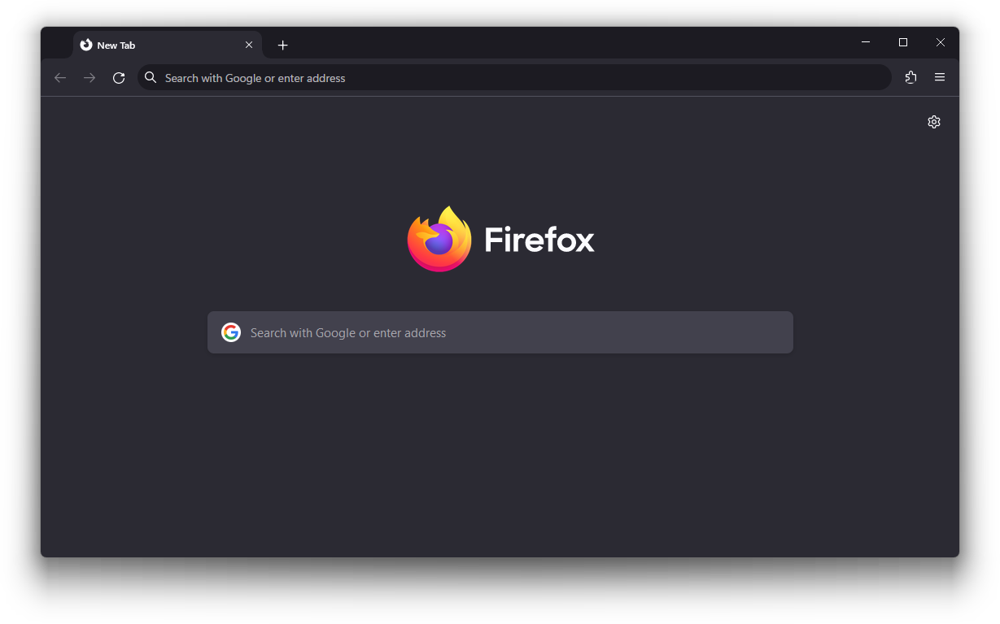

# Futurafox
A modern Firefox theme.

# Installation
Copy the chrome folder and user.js file into your Firefox profile directory. To find your profile directory, go to about:support or about:profiles. If you need a specific Firefox version, look in the releases.

If you have an existing user.js, paste Futurafox's user.js contents at the end

# Credits
* [MrOtherGuy's firefox-csshacks](https://github.com/MrOtherGuy/firefox-csshacks), used for curved tabs
* [/r/firefoxcss](https://reddit.com/r/firefoxcss/)
* Microsoft Edge and Google Chrome as an inspiration

# Customization
Minor customization can be done in the :root class of userchrome.css:

  * `--futura-tab-height`: How tall the tabs are
  * `--futura-tab-width`: How long the tabs are
  * `--futura-tab-font-weight`: How bold the tab names are
  * `--futura-tab-margin-top`: How much space between the tabs and the top of the window
  * `--futura-tab-margin-left`: How much space between the tabs and the left of the window
  * `--futura-tab-curve-size`: How round the tabs' curves are
  * `--futura-star-colour`: The colour of the bookmark star
  * `--futura-navbar-rounding`: How round the navbar is
